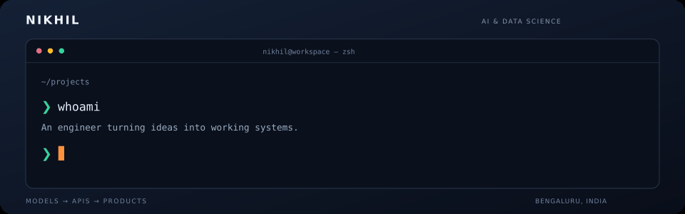
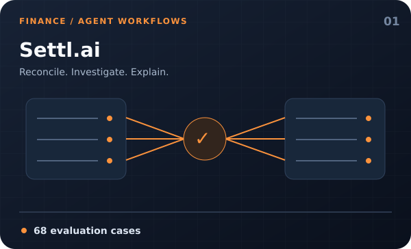
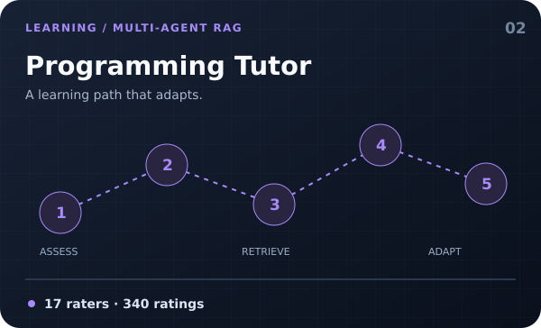
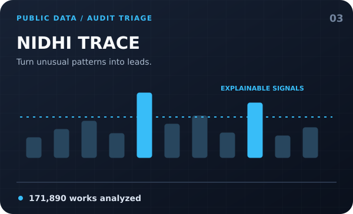
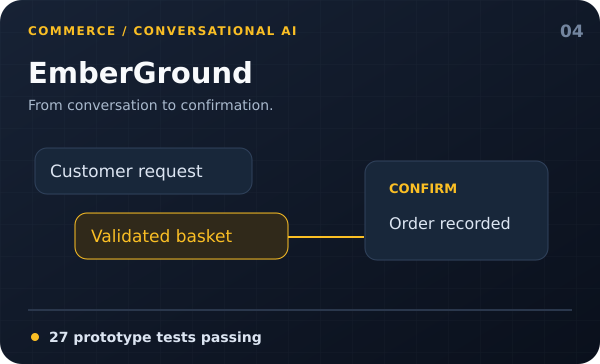
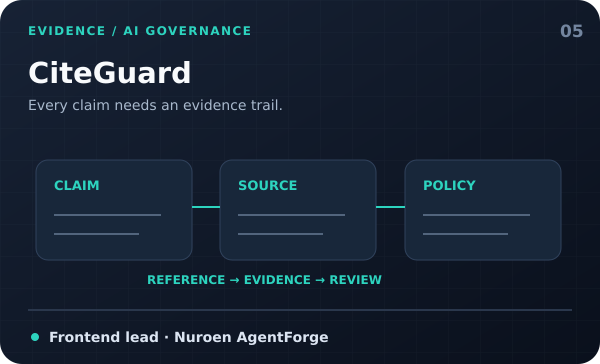
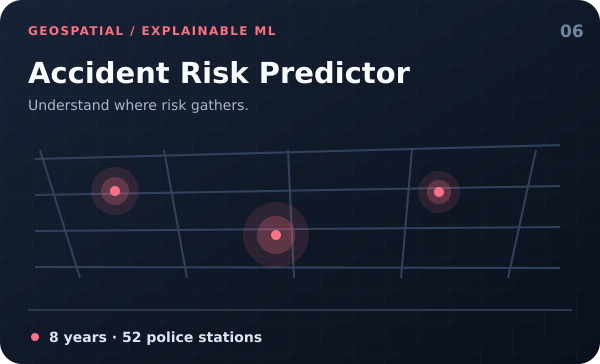
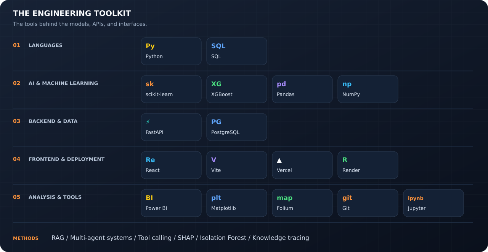
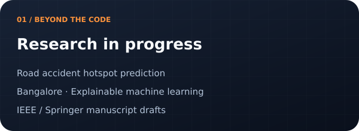
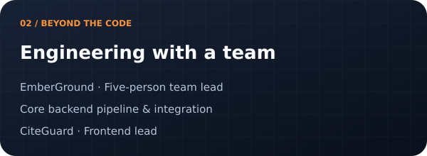

### Building ML systems and AI agents—from data pipelines to deployed products.

B.Tech · AI & Data Science · Alliance University, Bengaluru  
**Open to ML / GenAI internships and engineering collaborations**

[Projects](#projects) · [Toolkit](#toolkit) · [Research & Leadership](#research--leadership)

---

I'm **Nikhil**, a third-year AI & Data Science student building across **machine learning, backend engineering, and full-stack applications**. My projects span financial reconciliation, adaptive learning, public-data analysis, and agent-driven business workflows.

I care about what happens after the model responds: **evaluation, evidence, database integrity, and a usable interface**.

## Projects

Six projects across applied AI, data science, and full-stack engineering.

<table>
<tr>
<td width="50%" valign="top">

<h3>Settl.ai</h3>

Financial reconciliation with a processing pipeline, Q&A agent, and repeatable evaluation. Built for the <b>Razorpay AI Buildathon</b>.

<b>Evidence:</b> 68-case evaluation harness.

Python · FastAPI · React · LLM Agents

</td>
<td width="50%" valign="top">

<h3>Intelligent Programming Tutor</h3>

A <b>Planner, Assessor, and Tutor</b> work together with RAG and a four-parameter Bayesian Knowledge Tracing model.

<b>Evaluation:</b> 17 human raters, 340 ratings.

FastAPI · PostgreSQL · Llama 3.1 · RAG

</td>
</tr>
<tr>
<td width="50%" valign="top">

<h3>NIDHI TRACE</h3>

Statistical rules and Isolation Forest turn unusual MPLADS allocations and delays into explainable review signals.

<b>My role:</b> Backend development; teammate-built frontend.

Python · FastAPI · scikit-learn · Isolation Forest

</td>
<td width="50%" valign="top">

<h3>EmberGround</h3>

Gemini-powered Telegram ordering and booking with real inventory, tenant isolation, and confirmation-based transactions.

<b>Team lead:</b> Core pipeline, auth, tenant integrity, bot linking, n8n, and integration.

Gemini · FastAPI · PostgreSQL · React

</td>
</tr>
<tr>
<td width="50%" valign="top">

<h3>CiteGuard</h3>

Claim-level citation evidence, deterministic policy decisions, agent traces, and human review in one audit workspace.

<b>Frontend lead:</b> Report UI, demo, and evaluation page for Nuroen AgentForge.

React · Vite · FastAPI · Nuroen

</td>
<td width="50%" valign="top">

<h3>Bangalore Accident Risk Predictor</h3>

An end-to-end road-risk system combining regression and classification with SMOTE and SHAP explanations.

<b>Dataset:</b> Eight years of crash data across 52 police stations.

XGBoost · Random Forest · SHAP · FastAPI

</td>
</tr>
</table>

<b>Evaluation notes, project status & API links</b>

- **Settl.ai:** The 68 cases describe the project's evaluation set, not a guarantee on unseen financial data. [API docs](https://settl-ai.onrender.com/docs).
- **Programming Tutor:** 17 raters and 340 ratings describe the study size, not a measured improvement in learning outcomes. [API docs](https://intelligent-personalized-programming.onrender.com/docs).
- **NIDHI TRACE:** The documented snapshot contains 198,116 registered works and 171,890 analyzed works. Anomaly flags support human review, not findings of fraud. [Backend service](https://nidhitrace-api.onrender.com).
- **EmberGround:** The prototype documents 27 passing tests and live Telegram flows. No merchant pilot or live WhatsApp demonstration is claimed.
- **CiteGuard:** Recorded mock reports are available. Live GitHub/Nuroen integration remains unproven in the supplied project documentation.
- **Accident Risk Predictor:** [API docs](https://bangalore-accident-prediction-api.onrender.com/docs).

The project covers are conceptual illustrations, not application screenshots.

## Toolkit

<b>Toolkit in text</b>

- **Languages:** Python · SQL
- **AI & machine learning:** scikit-learn · XGBoost · Pandas · NumPy
- **Backend & data:** FastAPI · PostgreSQL
- **Frontend & deployment:** React · Vite · Vercel · Render
- **Analysis & tools:** Power BI · Matplotlib · Folium · Git · Jupyter
- **Methods:** RAG · Multi-agent systems · Tool calling · SHAP · SMOTE · Isolation Forest · Bayesian Knowledge Tracing
- **Models used in projects:** Llama 3.1 · Gemini

## Research & Leadership

<table>
<tr>
<td width="50%" valign="top">

<b>Predictive Analysis of Road Accident Hotspots in Bangalore</b>

Research connected to the accident-risk project. Manuscripts drafted in IEEE and Springer SN Computer Science formats; no publication claimed.

</td>
<td width="50%" valign="top">

<b>From individual components to integrated systems</b>

Led EmberGround's five-person team, contributing to the core backend pipeline and integration. Frontend lead for CiteGuard at Nuroen AgentForge.

</td>
</tr>
</table>

---

### Have a problem worth building for?

I'm open to **ML / GenAI internships**, applied AI projects, and engineering collaborations.

*Models. APIs. Interfaces. Evidence that they work.*

